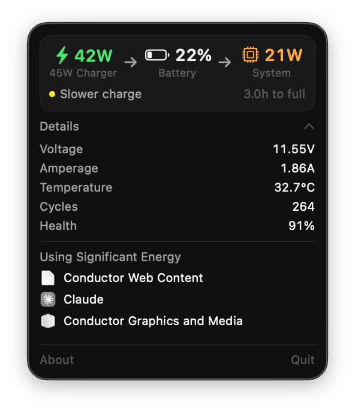
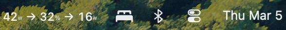

# BatteryBar

A lightweight macOS menu bar app that shows battery charge wattage, system consumption, and state of charge at a glance.





## Features

- **Live wattage display** in the menu bar: charge power (in), system consumption (out), and battery %
- **Charging diagnostics** — detects slow chargers, cable issues, thermal throttling, and trickle charging near full
- **Detail panel** with voltage, amperage, temperature, cycle count, health, and time remaining
- **Energy hog detection** — shows apps using significant energy
- **Automatic update checking** via GitHub releases
- **Sleep/wake aware** — pauses polling during sleep
- **Zero dependencies** — pure Swift + SwiftUI + IOKit, no third-party packages
- **No dock icon** — lives entirely in the menu bar

## Requirements

- macOS 13.0 (Ventura) or later
- Apple Silicon or Intel Mac with a battery

## Install

### Download

Grab `BatteryBar.app.zip` from the [latest release](https://github.com/isolson/BatteryBar/releases), unzip, and drag to `/Applications`.

### Build from source

```bash
git clone https://github.com/isolson/BatteryBar.git
cd BatteryBar
make build   # builds BatteryBar.app
make run     # builds and launches
make install # copies to /Applications
```

Requires Xcode Command Line Tools (`xcode-select --install`).

## How it works

BatteryBar reads directly from the IOKit `AppleSmartBattery` registry every 5 seconds. No shell commands are spawned — it uses `IOServiceGetMatchingService` and `IORegistryEntryCreateCFProperties` for minimal overhead.

- **Charge wattage**: `PowerTelemetryData.SystemPowerIn` (adapter power to system)
- **Consumption**: On AC: `SystemPowerIn - (Voltage * Amperage)`. On battery: `|Voltage * Amperage|`
- **SOC**: `CurrentCapacity` from the battery controller
- **Charging diagnostics**: `ChargerData` + `AppleRawAdapterDetails` for bottleneck detection

History is stored in `~/Library/Application Support/BatteryBar/history.json`.

## License

MIT
