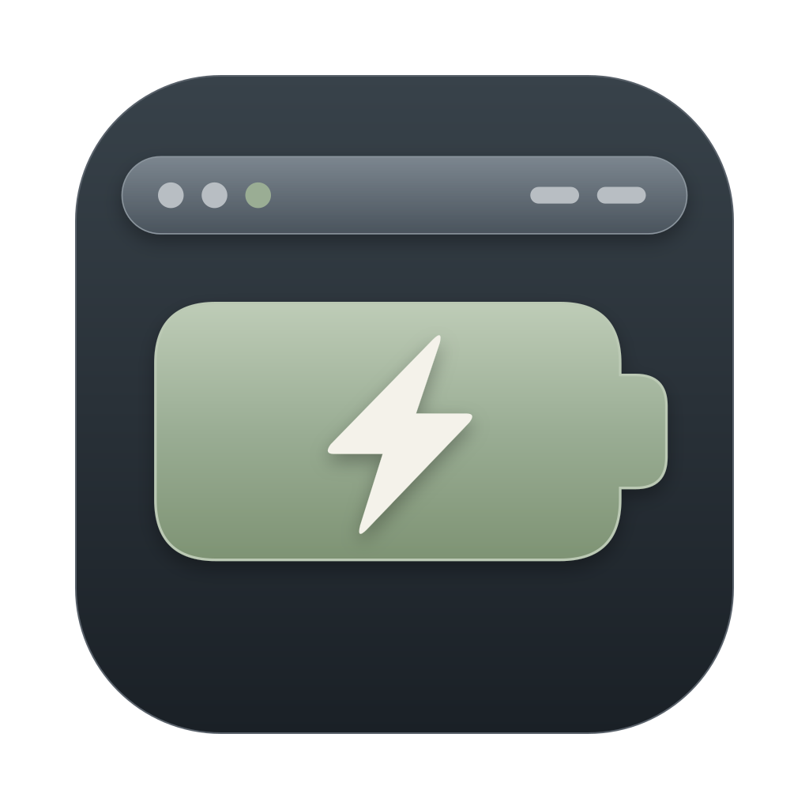
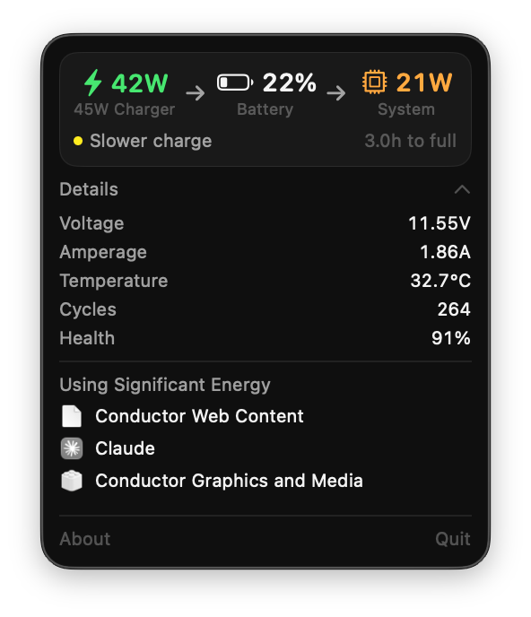

# BatteryBar



BatteryBar shows charger power, system power use, and battery charge in the macOS menu bar.




## Requirements

- An Apple Silicon MacBook (M1 or later)
- macOS 13 (Ventura) or later, including macOS 27

## Install

1. Download `BatteryBar.app.zip` from the [latest release](https://github.com/isolson/BatteryBar/releases/latest).
2. Open the ZIP file and drag `BatteryBar.app` to Applications.
3. Open BatteryBar from Applications. Its readings appear in the menu bar. Click them to open the detail panel.

To upgrade from v1.0.0, quit BatteryBar and install the latest download manually. The original release has no update checker.

## Features

- Live charger wattage, system power use, and battery percentage
- Charging estimates and possible charger, cable, or temperature limits
- Voltage, current, temperature, cycle count, health, and time remaining
- Apps with high CPU use, as an estimate of energy use
- An update link when a newer GitHub release is available
- Polling that pauses during sleep and resumes on wake
- Crash recovery with a limit on repeated restarts

Measurements depend on the Mac and macOS version. Missing temperature or health values show **Unavailable**. Missing power values show **--** in the menu and power diagram. Charging advice is an estimate.

## Build from source

Install Xcode Command Line Tools with `xcode-select --install`, then run:

```bash
git clone https://github.com/isolson/BatteryBar.git
cd BatteryBar
make build   # Create BatteryBar.app for local use
make run     # Build and open the app
make install # Replace the app in /Applications; quit that copy first
make test    # Run the tests
```

Local builds use an ad hoc signature for use on your Mac. Public downloads use Developer ID signing and Apple's notarization service. See the [release guide](docs/releasing.md).

## How it works

BatteryBar reads the IOKit `AppleSmartBattery` registry every five seconds. It uses `SystemPowerIn` for charger input and voltage × current for battery power. On AC power, system use is charger input minus battery charging power. On battery power, it is battery discharge power.

Health uses the reported full-charge capacity divided by design capacity. BatteryBar reads these values from the top-level registry fields or the nested `BatteryData` fields.

Temperature also falls back to `BatteryData.Temperature` on child `AppleSmartBatteryPack` entries. These values are hundredths of a degree Celsius. If the aggregate value is absent and multiple packs report a temperature, BatteryBar shows the highest one.

Battery polling uses no command processes. The energy estimate runs `ps` in the background with a time limit. Crash recovery uses a shell watcher and stops after three repeated restarts within a minute or if it cannot save its restart count. There are no third-party runtime packages. History is stored in `~/Library/Application Support/BatteryBar/history.json`.

If history contains damaged records, BatteryBar recovers valid records and keeps a copy of the original file. If it cannot keep that copy, it stops automatic history saves to protect the original.

## License

MIT
